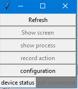
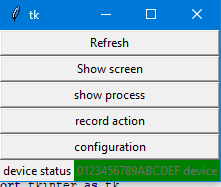
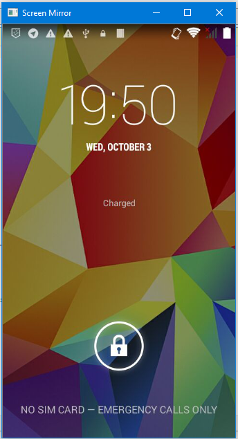

# droid_mirror

This application provides screen mirror of android phone.

## Requirements

The Android part requires at least API 2.0 (Android 2.0). Python 3.6 (not 3.7 since the airtest doesnt support it yet)

[enable-adb]: https://developer.android.com/studio/command-line/adb.html#Enabling

## RUN
pip install -r requirements.txt

## Expected to be added 
 | feature                                   |   expected date             |
 | --------------------------------------    |:----------------------------|
 | add mouse control like in DroidAtScreen1  |  unknow                     |
 | end project                               | `2019`                      |

## Related projects
related project on GitHub:

Airtest: https://github.com/AirtestProject/Airtest

Scrcpy: https://github.com/Genymobile/scrcpy

DroidAtScreen1: https://github.com/ribomation/DroidAtScreen1
